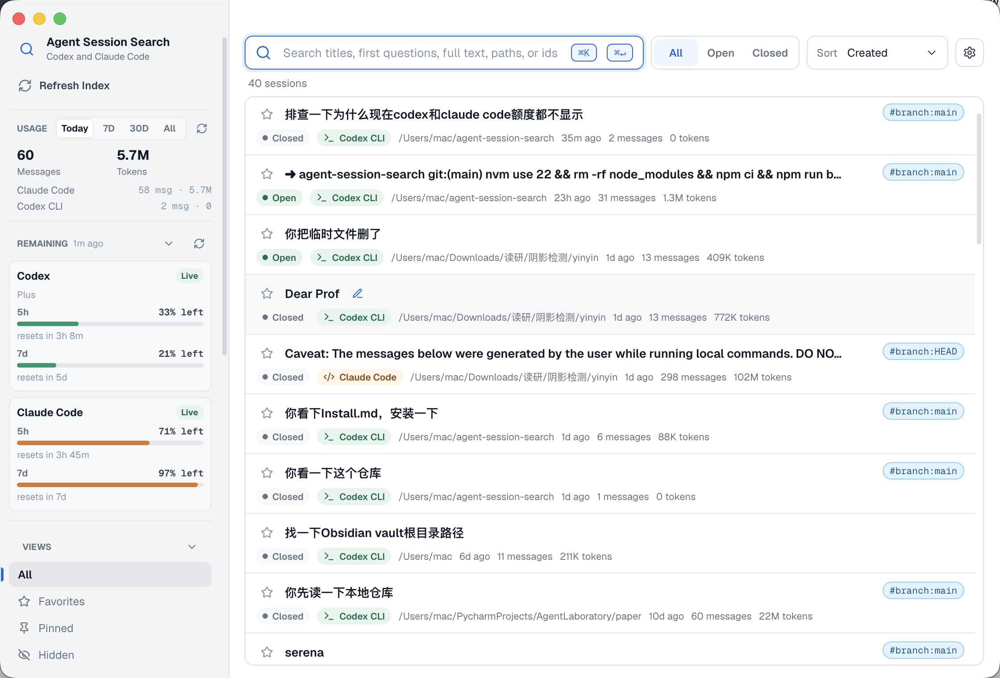

<h1 align="center">Agent-Session-Search</h1>

<p align="center">本地桌面工具 · 一处搜索、整理、分析与恢复多种 AI Coding Agent 会话</p>

<p align="center">
  简体中文 ｜ <a href="./docs/README.en.md">English</a>
</p>

<p align="center">
  
  
  
  
</p>

<p align="center">
  
</p>

Agent-Session-Search 是一个本地桌面工具，用来搜索、整理、分析和恢复 AI Coding Agent 的历史会话。

它默认读取本机已有的 Claude / Codex session，也可以通过 SSH 读取远程机器上的 Claude / Codex session；CodeBuddy CLI、OpenClaw、Hermes、OpenCode、Cursor Agent、Trae 等本地来源可在 Settings 的 Optional sources 中开启。应用会建立本地搜索索引，并允许你给每个 session 添加自定义标题、标签、置顶和隐藏状态。这些额外信息都存放在独立的本地 SQLite 数据库里；索引和整理默认不会修改原始 session 数据。只有用户确认删除独立 session 文件时才会删除对应源文件；Hermes / OpenCode 这类共享 SQLite 数据库不会被整库删除。

## 功能

### 核心功能

- **统一搜索和管理多种 AI Coding Agent 会话**
  搜索、过滤、查看、整理和恢复 Claude Code、Codex，以及可选的 CodeBuddy、OpenClaw、Hermes、OpenCode、Cursor Agent、Trae 等会话；支持自定义标题、标签、收藏、置顶、隐藏和一键 resume；也支持本地环境和 SSH 远程环境，远程机器无需安装本应用。
- **完整查看会话上下文**
  详情页展示完整消息、tool call、Markdown / code block 和 AI 摘要，并支持导出 Markdown。
- **AI / Agent 辅助检索历史会话**
  支持 AI 摘要和自然语言找会话；同时开放只读 MCP 能力，让 Claude Code / Codex / CodeBuddy 可以在对话里直接搜索和读取历史会话。
- **跨 Agent 迁移会话**
  支持把 Claude / Codex / CodeBuddy 会话迁移到另一个 Agent，并在迁移后继续工作。
- **统一查看 Agent 用量和额度**
  统计今日、近 7 天、近 30 天和全部时间的各 Agent token 使用量；同时查看 Claude Code / Codex 的当前额度状态。
- **统一管理 Skills 和 API Provider**
  查看和管理 Claude Code / Codex skills，统计 skill 使用情况；在界面里切换 Codex / Claude Code 的官方账号或第三方 API Provider。

## 支持的数据源

| 来源 | 本地文件 |
| --- | --- |
| Codex CLI | `~/.codex/sessions/**/*.jsonl` |
| Codex Desktop | `~/.codex/sessions/**/*.jsonl`，通过 session metadata 识别 |
| Claude Code CLI | `~/.claude/projects/*/*.jsonl`，以及可选的 `~/.claude/sessions/*.json` 元数据 |
| Claude Desktop app | `~/Library/Application Support/Claude/claude-code-sessions/**/local_*.json`，以及 Claude Code 项目日志 |
| CodeBuddy CLI | 可在设置中开启，读取 `~/.codebuddy/projects/**/*.jsonl` |
| OpenClaw | 可在设置中开启，读取 `~/.openclaw/agents/*/sessions/*.jsonl`，兼容 `~/.clawdbot/agents/*/sessions/*.jsonl`，排除 `*.trajectory.jsonl` |
| Hermes | 可在设置中开启，读取 `~/.hermes/state.db` |
| OpenCode | 可在设置中开启，读取 `~/.local/share/opencode/opencode.db` |
| Cursor Agent | 可在设置中开启，读取 `~/.cursor/projects/**/agent-transcripts/**/*.jsonl` |
| Trae | 可在设置中开启，读取 `~/.trae-cn/memory/projects/**/session_memory_*.jsonl`；打开状态会读取 Trae workspace 的本地状态库 |
| SSH 远程环境 | 通过 SSH 读取远端用户目录下同样的 Codex / Claude Code session 路径 |

当 `~/.codex/session_index.jsonl` 存在时，应用会读取 Codex 的标题元数据。没有上游标题时，会使用第一个有效用户问题作为默认标题。

CodeBuddy CLI、OpenClaw、Hermes、OpenCode、Cursor Agent 和 Trae 默认关闭，可在 Settings -> Optional sources 里选择监测。开启后支持本地只读索引、搜索、详情查看和来源过滤；Resume、远程 SSH 同步和专属用量统计会后续按来源单独补齐。Trae 额外支持打开状态检测。

## Resume 行为

点击 Resume 或按 `Cmd/Ctrl+Enter` 时，应用会先判断当前 session 是否已经在本机打开：

- 如果已经打开，应用会定位对应的进程和父级终端进程，并前置已有的 Terminal / iTerm / Ghostty / WezTerm / Warp。Terminal 和 iTerm 会尽量精确切到对应 tty 的窗口或标签页；如果系统无法提供 tty 信息，则退化为前置对应终端应用。
- 如果没有打开，应用会在设置里的默认终端中启动新的恢复命令，例如 `codex resume <session-id>` 或 `claude --resume <session-id>`。
- SSH 远程 session 会先做远端项目路径和 CLI 预检，然后在本地默认终端里通过 `ssh` 执行远端恢复命令。

## 让 Agent 检索历史会话（MCP）

可以把历史会话以**只读** MCP 服务的形式开放给 Claude Code / Codex / CodeBuddy，让它们在对话里直接“回忆”你以前是怎么解决某个问题的。

启用只需两步（默认关闭）：

1. 打开 **Settings → AI → 启用会话检索 MCP**（或命令行 `node bin/setup-mcp.cjs`，移除用 `node bin/setup-mcp.cjs uninstall`）。这会把服务写入 `~/.claude.json`、`~/.codex/config.toml`、`~/.codebuddy/mcp.json`，并自动选用一个 Node ≥ 22 的可执行文件（MCP 服务依赖 `node:sqlite`）。
2. **重启** Claude Code / Codex / CodeBuddy，让它们加载新的 MCP 服务。

之后**无需手动调用工具**——agent 会在需要时自动检索，你也可以直接说“搜一下我以前关于 X 的会话”。可用工具：`search_sessions`（结合 AI 摘要的全文检索）、`get_session`（按 `offset` 翻页读取长会话）、`list_projects`、`list_tags`。

> 服务只读数据库，桌面 App 不开也能用；但内容只在 App 运行索引后才更新。数据库位置由 App 启动时写入的指针文件提供，也可用环境变量 `AGENT_SESSION_SEARCH_DB` 覆盖。

## SSH 远程会话

SSH 远程环境不需要在远端安装 Agent-Session-Search，也不会在远端写入数据库。应用会在本机通过系统 `ssh` 连接远端，在远端执行一个临时 Python collector，读取远端 `~/.codex` 和 `~/.claude` 下的 session 摘要，再把摘要写入本机 SQLite。

远程同步方式：

- 添加或启用 SSH 环境后，会先完整同步一次最近 session 摘要。
- 如果远端有 `inotifywait`，会通过 SSH 长连接监听 `~/.codex/sessions`、`~/.codex/session_index.jsonl`、`~/.claude/projects`、`~/.claude/sessions`。
- 如果没有 `inotifywait` 但有 `fswatch`，会使用 `fswatch` 监听 `~/.codex` 和 `~/.claude`。
- 如果两者都没有，会退化为每 60 秒轮询同步。
- 远程详情按需加载：列表默认只保存摘要，点开某个远程 session 时才通过 SSH 拉取对应原始文件内容。

远程机器需要：

- 能从本机通过 `ssh` 非交互连接。
- 安装 `python3`。
- 想要实时监听时安装 `inotifywait` 或 `fswatch`；没有也能使用轮询。

## 快捷键

| 快捷键 | 作用 |
| --- | --- |
| `Option+Space` | macOS 下唤起或隐藏搜索窗口 |
| `Cmd/Ctrl+K` | 聚焦并选中搜索框 |
| `↑` / `↓` | 在主界面会话列表中移动选中项 |
| `Space` | 打开当前选中会话详情 |
| `Enter` | 搜索框聚焦时打开当前选中会话详情 |
| `Cmd/Ctrl+Enter` | 在默认终端中恢复当前选中会话 |
| `Cmd/Ctrl+,` | 打开 Settings |

## 数据边界

Agent-Session-Search 会把两类数据分开处理：

- Claude / Codex / OpenClaw / Cursor Agent / Trae 等独立 session 文件在索引、搜索、标注时只作为只读输入；显式确认删除 session 时会删除对应源文件。Hermes / OpenCode 使用共享 SQLite 数据库，应用不会为了删除单个 session 而删除整库。
- SSH 远程 session 文件也只作为只读输入，通过 SSH 拉取摘要和按需详情。
- 执行跨 Agent 迁移时，应用会在目标 Agent 的本机 session 目录下创建新的会话文件，并在本地数据库记录源会话和目标会话的迁移关系；不会改写源会话文件。
- 自定义标题、标签、收藏、置顶、隐藏状态、搜索索引、远程环境配置、Skill 使用索引和 API Provider key 存放在 Electron `userData` 目录下的本地 SQLite 数据库中。
- 应用 Codex / Claude Code Provider 时，会按对应 CLI 的配置格式修改本机 `~/.codex/config.toml` 或 `~/.claude/settings.json`，并先写入备份。

## 安装使用

### macOS

要求 Node.js 22.13+（含 npm）。进入仓库目录后，执行下面命令即可安装依赖、构建并注册全局命令：

```bash
nvm install 22 && nvm use 22 && npm ci && npm run build && npm install -g .
```

如果你不用 nvm，只要本机 `node --version` 是 22.13 或更高版本，可以直接从 `npm ci` 开始执行。

装好后，在任意终端运行 `agent-session-search` 即可启动。应用常驻后台（菜单栏有图标），默认按 **⌥ Option + Space** 唤起搜索窗口；如果和 Raycast 等工具冲突，可以在 Settings 里修改或关闭全局快捷键。

Settings 也可以通过 `Cmd+,` 打开；在 Appearance 里可以切换明暗主题和 English / 中文界面。

后续日常启动不需要重新执行安装命令，也不需要重新 build，直接运行：

```bash
agent-session-search
```

如果新终端提示 `agent-session-search: command not found`，通常是因为全局命令安装在 nvm 的 Node 22 目录下，但当前 shell 没有选中 Node 22。可以先运行：

```bash
nvm use 22
agent-session-search
```

也可以一次性设置默认 Node 版本，之后新终端就不需要手动 `nvm use 22`：

```bash
nvm alias default 22
```

### Windows

确认 Node.js 22.13+ 后，在仓库目录里用 PowerShell 执行：

```powershell
npm ci && npm run build && npm install -g .
```

装好后，在任意终端运行 `agent-session-search` 即可启动。应用常驻后台（任务栏/托盘有图标），默认按 **Ctrl + Alt + Space** 唤起搜索窗口。

更新、卸载、从源码克隆、网络镜像等详情见 [Install.md](./Install.md)。

## 开发环境

要求：

- macOS 或 Windows
- Node.js 22.13 或更高版本
- npm

安装依赖：

```bash
npm install
```

运行测试：

```bash
npm test
```

启动开发版桌面应用：

```bash
npm run dev
```

构建应用：

```bash
npm run build
```

## 仓库文档

- `README.md`：中文项目说明，面向普通读者和开发者。
- `docs/README.en.md`：英文项目说明。
- `Install.md`：安装、更新、卸载说明，也包含给 Coding Agent 安全初始化项目环境的执行文档。

有任何问题，请提交issue。如果觉得我们的项目还不错，欢迎star✨。
